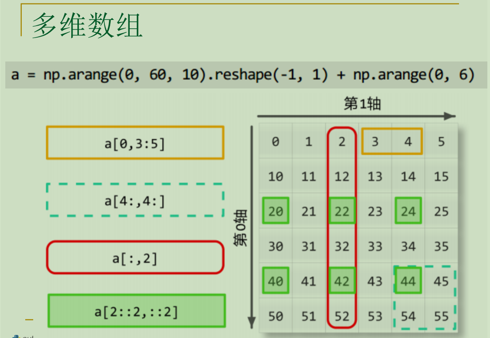
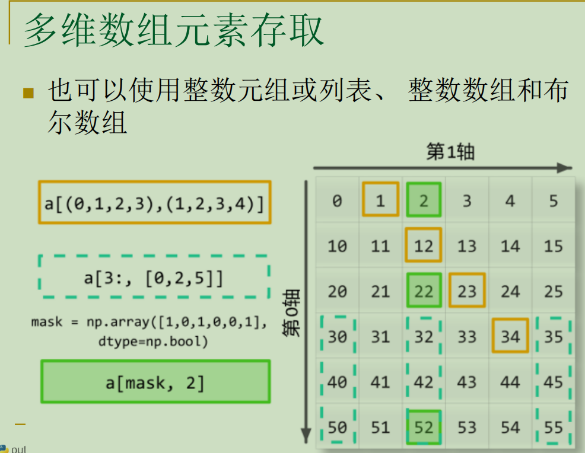
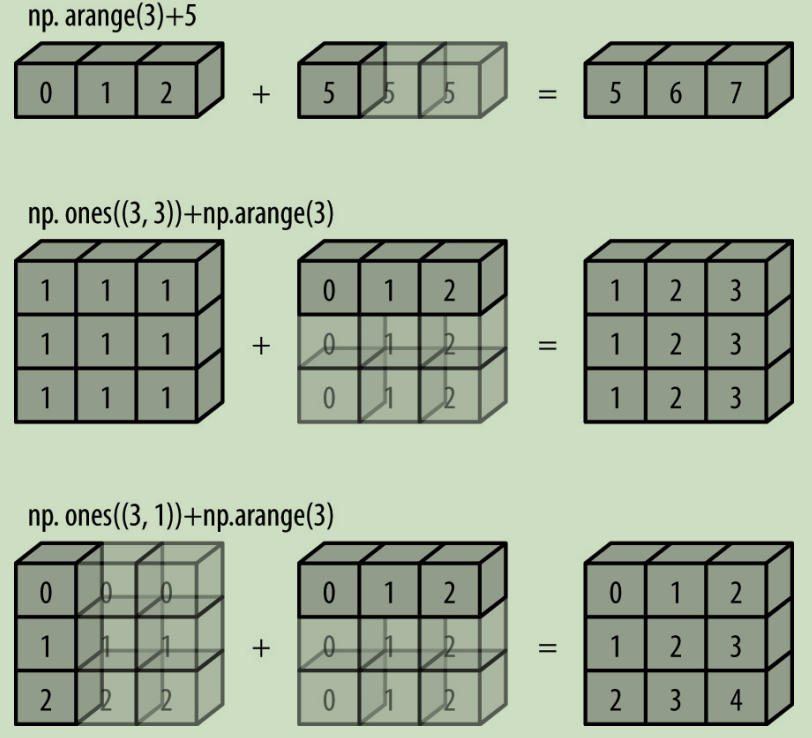

# 01. 数组(ndarray)

## 1. 数组的属性
| 属性 | 类型 | 说明 |
| -- | -- | -- |
| **shape** | tuple | 数组每一维度的数量 |
| dtype | numpy.dtype | 表示数组的*数据类型* |
| ndim | int | 数组维度数 |
| size | int | 元素个数 |
| nbytes | int | 总字节数 |
| itemsize | int | 单个元素所占字节数 |
| T | ndarray | 数组对象的转置数组 |
| flat | numpy.flatiter | 扁平迭代器 |
| real | ndarray | 复数数组的实部数组 |
| imag | ndarray | 复数数组的虚部数组 |


## 2. 数组的创建
### 2.1 调用numpy的array()函数。
* 格式： array(object, dtype=None, *, copy=True, order='K', subok=False, ndmin=0,like=None)
* 返回值： ndarray,满足具体要求的数组。
* 参数说明：
| 参数 | 类型 | 说明 |
| -- | -- | -- |
| object | array_like | An array, any object exposing the array interface, an object whose__array__ method returns an array, or any (nested) sequence. |
| dtype  | data-type, optional | The desired data-type for the array. |
| copy  | bool, optional | If true (default), then the object is copied. |
| order | {'K', 'A', 'C', 'F'}, optional | 指定数组元素的存储顺序。C：行优先 F：列优先 K：元素在内存中出现的顺序 A：原顺序|

array函数接受序列型对象，如列表，元组作为参数，返回一个类型为ndarry的数组。这是numpy的基础数据类型。与列表不同，ndarry必须包含同一数据类型，否则向上转换或报错。

numpy支持的数据类型如下:


使用array创建数组时，如果没有指定数据类型，将默认为浮点数类型。

```python
import numpy as np
x=np.array([1,2,3,4,5,6])
print(type(x))
print(x)
#输出
#<class 'numpy.ndarray'>
#[1 2 3 4 5 6]

x=np.array([[1,2,3],[4,5,6]])
print(x)
print(x.shape,x.dtype,x.size,x.ndim)#形状，数据类型，元素个数，维度
'''
输出
[[1 2 3]
 [4 5 6]]
(2, 3) int32 6 2
'''
x=np.array([a for a in range(10)])#迭代器
print(x)
print(x.shape,x.dtype,x.size,x.ndim)
'''
输出
[0 1 2 3 4 5 6 7 8 9]
(10,) int32 10 1
'''

x=np.array([range(a,a+5) for a in range(5)])#嵌套列表
print(x)
print(x.shape,x.dtype,x.size,x.ndim)
'''
输出
[[0 1 2 3 4]
 [1 2 3 4 5]
 [2 3 4 5 6]
 [3 4 5 6 7]
 [4 5 6 7 8]]
(5, 5) int32 25 2
'''
```
### 2.2 调用numpy的arange()，linspace()，logspace()方法
1. arange()
* 格式： `numpy.arange(start, stop, step, dtype)`
> 与python的range函数类似，start和stop相当于一个**左闭右开**的区间。step为步长默认为1，dtype为数据类型。函数返回一个ndarry数组。
step 可以是浮点数、负数
2. linspace()
* 格式： `np.linspace(start, stop, num=50, endpoint=True, retstep=False, dtype=None)`
> 该函数也可以用来创建等差数列数组。与arange函数不同，linspace的num参数为创建的**数组元素个数**，步长为(stop-start)/(num-1).
同时start和stop相当于一个左闭右闭的区间。
将 endpoint 设为 false，结果不包含终止值。
```python
x=np.arange(10)
print(x)
print(x.shape,x.dtype,x.ndim,x.size)
'''
输出
[0 1 2 3 4 5 6 7 8 9]
(10,) int32 1 10
'''

x=np.arange(1,11,2)
print(x)
print(x.shape,x.dtype,x.ndim,x.size)
'''
输出
[1 3 5 7 9]
(5,) int32 1 5
'''

a=np.linspace(0,5,6)
print(a)
'''
[0. 1. 2. 3. 4. 5.]
'''

a=np.linspace(2,25,5,False)
print(a)
'''
[ 2.   6.6 11.2 15.8 20.4]
'''
```
3. numpy.logspace()
> 用于创建一个于**等比数列**。它返回在对数刻度上均匀间隔的数字构成的数组。

这是什么意思呢，例如先取一个基底base=2，然后指定一个范围[0,8]和元素个数9，返回一个以等差数列为指数的等比数列。

* 格式： `np.logspace(start, stop, num=50, endpoint=True, base=10.0, dtype=None)`
* 返回值： ndarray
```python
import numpy as np    
print(np.logspace(0,9,11,base=2,endpoint=True))
print([2**x for x in np.linspace(0,9,11)])

#它们生成的数据是一样的

'''
[  1.   2.   4.   8.  16.  32.  64. 128. 256. 512.]
[1.0, 2.0, 4.0, 8.0, 16.0, 32.0, 64.0, 128.0, 256.0, 512.0]

'''

print(np.logspace(1,10,10))
print([10**x for x in np.linspace(1,10,10)])

'''
[1.e+01 1.e+02 1.e+03 1.e+04 1.e+05 1.e+06 1.e+07 1.e+08 1.e+09 1.e+10]
[10.0, 100.0, 1000.0, 10000.0, 100000.0, 1000000.0, 10000000.0, 100000000.0, 1000000000.0, 10000000000.0]

'''
y=np.logspace(1,10,20)
print(y)
'''
[1.00000000e+01 2.97635144e+01 8.85866790e+01 2.63665090e+02
 7.84759970e+02 2.33572147e+03 6.95192796e+03 2.06913808e+04
 6.15848211e+04 1.83298071e+05 5.45559478e+05 1.62377674e+06
 4.83293024e+06 1.43844989e+07 4.28133240e+07 1.27427499e+08
 3.79269019e+08 1.12883789e+09 3.35981829e+09 1.00000000e+10]
'''
```

### 2.3 调用ones，zeros，full，empty方法

```python
a=np.ones((3,4),dtype=int)
print(a)
'''
[[1 1 1 1]
 [1 1 1 1]
 [1 1 1 1]]
'''

a=np.zeros((3,4))
print(a)
'''
[[0. 0. 0. 0.]
 [0. 0. 0. 0.]
 [0. 0. 0. 0.]]
'''

a=np.full((3,4),4.2)
print(a)
'''
[[4.2 4.2 4.2 4.2]
 [4.2 4.2 4.2 4.2]
 [4.2 4.2 4.2 4.2]]
'''

a=np.full((2,2),9)
print(np.full_like(a,3))
'''
[[3 3]
 [3 3]]
ones_like,zeros_like类似。
'''
```

###  2.4 调用tile函数
>tile意为展开，铺设。它接受两个参数，格式为tile(A，reps)。
* 格式： `tile(A, reps)`
* 返回值： ndarray，展开后的数组。
* 参数说明：
    * A的数据类型：array_like，例如数组，列表，元组，字典，以及int，float，string等。

    * B的数据类型：array_like，例如数组，列表，元组，字典，int等。

A通常为需要进行操作的输入数组，B为A在每个轴上的重复次数。

函数的返回值为数组。

简单理解为将A视为一个元素，B为返回数组的形状(shape)。

实例：
```python
a=np.tile(2,9)
print(a)
#[2 2 2 2 2 2 2 2 2]

a=np.tile((2,2),(2,2))#两个参数均为元组
print(a)
'''
[[2 2 2 2]
 [2 2 2 2]]
'''

a=[2,3,4]
b=np.tile(a,4)
print(b)
'''
[2 3 4 2 3 4 2 3 4 2 3 4]
'''

a=np.arange(4).reshape(2,2)
b=np.tile(a,[2,2])
print(b)
'''
[[0 1 0 1]
 [2 3 2 3]
 [0 1 0 1]
 [2 3 2 3]]
'''
```

### 2.5 调用diag()创建对角矩阵

```python
x=np.diag([1,2,3,4])
print(x)
"""
[[1 0 0 0]
 [0 2 0 0]
 [0 0 3 0]
 [0 0 0 4]]
"""
```

### 2.6 由自定义函数创建
1. np.fromfunction()
```python
def fun(x,y):
    return 2*x+y
l=np.fromfunction(fun,(3,6))
#fun()接收的参数就是矩阵元素的坐标
print(l)
'''
[[0. 1. 2. 3. 4. 5.]
 [2. 3. 4. 5. 6. 7.]
 [4. 5. 6. 7. 8. 9.]]
'''
```

2. np.fromiter()
> 从可迭代对象建立ndarray对象，返回一维数组。
```python
l=np.fromiter((x**2 for x in range(0,6)),int)
print(l)

#[ 0  1  4  9 16 25]
```

### 2.7 随机数组创建
#### 1. np.random.rand() np.random.random() 
> 生成指定形状的0-1之间的随机数组。区别在于前者参数为多个整数，后者是一个序列。
```python
a=np.random.random((3,2))
b=np.random.rand(2,3)
print(a,2*"\n",b)

# [[0.92121226 0.02247888]
#  [0.39044403 0.08281157]
#  [0.67822274 0.48432339]] 

#  [[0.58183831 0.47706858 0.08828412]
#  [0.28485837 0.53791803 0.1256546 ]]
```
#### 2. np.random.randn()
> 标准正态分布
```python
b=np.random.randn(2,3)
print(b)

# [[-0.58095833 -2.90148355  2.33022057]
#  [ 0.458806   -0.64570515 -1.1560223 ]]
```
#### 3. np.random.normal
> 指定均值和方法的正态分布
* 格式：`normal(loc=0.0, scale=1.0, size=None)`
三个参数分别是：均值、方差、元素个数
```python
a=np.random.normal(1,0.5,4)
# [1.57883425 0.95897684 0.8493202  1.14610196]
```
#### 4. np.random.randit()
> 生成指定范围内的随机整数
* 格式：`randint(low, high=None, size=None, dtype=None)`
* 参数说明：最小值、最大值、返回数组形状、数据元素类型
```python
a=np.random.randint(1,5,10)
# [1 2 3 3 3 4 2 3 1 4]
```
#### 5. np.random.seed()
> 设置种子，相同种子调用random函数结果一致

#### 6. np.random.shuffle()
> 打乱数组元素顺序
该函数没有返回值，直接对传入数组进行修改
```python
x=[1,2,3,4,5,6]
np.random.shuffle(x)
print(x)
#[6, 4, 2, 5, 1, 3]
```

#### 7. np.random.uniform()
> 选择指定区间的均匀分布随机数，区间左开右闭
* 格式： `uniform(low=0.0, high=1.0, size=None)`
```python
x=np.random.uniform(1,100,10)
print(x)
# [23.67407963 38.34110513 54.68831863  9.28520362 95.15048023 89.72708317
# 80.54592304 69.74768056 75.27314397 67.69583441]
```

#### 8. np.random.choice()
> 按照指定概率从指定集合中生成随机数。
* 格式： `choice(a, size=None, replace=True, p=None)`
* 参数说明： 指定数集、数组形状、元素可否重复、数值选中概率(总和必须为1)
```python
a=np.random.choice([1,2,3,4],size=10000,p=[0.1,0.5,0.2,0.2])
```

## 3. 数组切片与索引
### 3.1 一维数组切片
> 与python中列表切片非常类似。

1. 通过下标选取元素，下标从0开始。
```python
x=np.arange(9)
print(x[[4,5,6,2]])
print(type(x[[4,5,6,2]]))

'''
[4 5 6 2]
<class 'numpy.ndarray'>
'''
```
2. 通过切片获取，切片是一个左闭右开区间。
```python
x=np.arange(9)
print(x[2:7])
#[2 3 4 5 6]
```
还可以选取步长。
```python
x=np.arange(18)
print(x[2:16:2])
[ 2  4  6  8 10 12 14]
```
也可以选取负数下标进行数组翻转。
```python
x=np.arange(18)
print(x[::-1])
[17 16 15 14 13 12 11 10  9  8  7  6  5  4  3  2  1  0]
```
3. 使用逻辑运算符选取切片。
```python
x=np.arange(18)
print(x[(x>2)&(x<15)])

'''
[ 3  4  5  6  7  8  9 10 11 12 13 14]
'''

x=np.arange(18)
print(x[(x>2)|(x<15)])

'''
[ 0  1  2  3  4  5  6  7  8  9 10 11 12 13 14 15 16 17]
'''
#布尔数组索引
x=np.arange(6)
a=np.array([True,False,False,True,True,True])
print(x[a])

'''
[0 3 4 5]
'''
```

### 3.2 多维数组切片
谈到多维数组就必须理解数组的维度和轴的概念了。不赘述。

多维数组切片与数组的分割很类似。我们在做数组切片时，参数的顺序也是轴的顺序。

每一条轴都可以视为一个一维数组，方法自然大同小异了。

```python
x=np.arange(24).reshape(2,3,4)
pp.pprint(x)
pp.pprint(x[0,:,:])#选取第一轴的第一个元素
pp.pprint(x[:,0,:])#选取第二轴的第一个元素
pp.pprint(x[:,:,0])#选取第三轴的第一个元素
pp.pprint(x[:,::-1,::-1])#倒序输出
pp.pprint(x[:,::2,::3])#指定步长
pp.pprint(x[:,:,:-1])#第一轴倒序

'''
array([[[ 0,  1,  2,  3],
        [ 4,  5,  6,  7],
        [ 8,  9, 10, 11]],

       [[12, 13, 14, 15],
        [16, 17, 18, 19],
        [20, 21, 22, 23]]])
array([[ 0,  1,  2,  3],
       [ 4,  5,  6,  7],
       [ 8,  9, 10, 11]])
array([[ 0,  1,  2,  3],
       [12, 13, 14, 15]])
array([[ 0,  4,  8],
       [12, 16, 20]])
array([[[11, 10,  9,  8],
        [ 7,  6,  5,  4],
        [ 3,  2,  1,  0]],

       [[23, 22, 21, 20],
        [19, 18, 17, 16],
        [15, 14, 13, 12]]])
array([[[ 0,  3],
        [ 8, 11]],

       [[12, 15],
        [20, 23]]])
array([[[ 0,  1,  2],
        [ 4,  5,  6],
        [ 8,  9, 10]],

       [[12, 13, 14],
        [16, 17, 18],
        [20, 21, 22]]])

进程已结束，退出代码为 0

'''
```




## 4.  数组的组合和分割
在介绍数组的组合和分割前，我们需要先了解数组的轴(`axis`)和维(`ndim`)概念。

* 轴（axis）：通常指数据存储的方向，对于一个二维数组，其第 0 轴表示行方向，第 1 轴表示列方向。在 NumPy 中，axis 属性用于指定某个操作的方向，例如在对一个二维数组进行求和操作时，指定 axis=0 则表示对每一列进行求和，而指定 axis=1 则表示对每一行进行求和。需要注意的是，轴的编号是从 0 开始的。

* 维（dimension）：NumPy 数组的维度是指数组中的轴数，也称为 ndim。

如果数组的元素是数组，即数组嵌套数组，我们就称其为`多维数组`。几层嵌套就称几维。比如形状为(a，b)的二维数组就可以看作两个一维数组，第一个一维数组包含a个一维数组，第二个一维数组包含b个数据。

每一个一维线性数组称为一个轴。二维数组的第一个轴(axis=0)就是以数组为元素的数组，第二个轴(axis=1)就是数组中的数组。因此第一个轴的方向就是沿着行的方向（垂直方向），第二个轴的方向沿着列的方向（水平方向）。

我们从嵌套数组的角度来看，a[0]，a[1]，a[2]，a[3]……分别是取二维数组的第一行，二行，三行，四行……这正是先沿着第一个轴取元素（元素为行）。a[0][0]，a[0][1]……则是（沿着第二个轴）取第一行的第一个元素，第二个元素……

也就是说，数组的轴从最外层数起。

 

三维数组我们应该怎么理解呢？我们可以把它看作二维数组的堆叠，即一个立方体。它的第一个轴（axis=0）就是以二维数组为元素的数组，它的方向沿着二维数组堆叠的方向，也就是立方体的高。第二个轴自然就是立方体的宽，第三个轴就是立方体的长。举例来说，一个形状为（a，b，c）的三维数组就是a个形状为（b，c）的二维数组嵌套在一起。

```python
a=np.arange(24).reshape(2,3,4)#建立一个维度为3，形状为（2，3，4）的三维数组
print(a)#打印
print(a.sum(axis=0))#沿第一个轴求和
print(a.sum(axis=1))#沿第二个轴求和
print(a.sum(axis=2))#沿第三个轴求和

'''
a的形状如下：
[[[ 0  1  2  3]
  [ 4  5  6  7]
  [ 8  9 10 11]]

 [[12 13 14 15]
  [16 17 18 19]
  [20 21 22 23]]]
 
 沿第一个轴求和：
 [[12 14 16 18]
 [20 22 24 26]
 [28 30 32 34]]
 
 沿第二个轴求和：
 [[12 15 18 21]
 [48 51 54 57]]
 
 沿第三个轴求和：
[[ 6 22 38]
 [54 70 86]]
'''
```

从这个例子可以看出，沿第一个轴求和，就是从上方把这个立方体“压扁”，第二个轴就是沿着宽，第三个轴就是沿着长。类似投影。

可以看出，数组的属性shape和reshape函数的参数顺序不能想当然地认为是长，宽；长，宽，高；因为无法解释为什么三维数组变形后的形状与你所想的大相径庭。它的顺序是轴的顺序（第一条轴，第二条轴，第三条轴……），也就是沿这条轴有多少个元素。轴的概念很重要，在很多函数中都有体现。

再直观一点说，参数顺序应该是高，宽（行方向），长（列方向）。

 

所以，数组的维度就很好理解了，就是轴的数量。我们在理解多维数组的时候，不要先入为主地认为多维数组的元素会更多；多维数组只是它嵌套的层数多而已。

接下来我们介绍数组的组合。

### 4.1 数组的组合
>水平方向是沿列方向，axis=1
垂直方向是沿行方向，axis=0
二维数组的形状是（行，列）

数组的组合有水平组合，垂直组合，深度组合等方式。实现这些组合的函数主要有vstack，dstack，hstack，column_stack，row_stack，concatenate等。

因为我们最常用的数组也不过三维，所以用水平，垂直这样的字眼比较形象；但我们要明白，本质上是**沿轴**进行的操作。

进行组合的数组，必须维度相同，其形状除了进行组合的轴外必须相同。

数组组合通常不会改变数组的维度。

#### 1. 水平组合

hstack()函数与concatenate()函数

1. hstack()：水平连接多个数组。参数只有一个：以数组为元素的序列。
2. concatenate()：沿着现有的轴连接数组序列。

* 格式：concatenate((a1, a2, ...), axis=0, out=None)
* 参数说明：a1, a2, ...：为**以数组为元素**的类数组序列。其中数组**形状**必须相同。
axis：数组将沿着这个轴组合，如果坐标轴为None，数组在使用前被平铺。int型数据，可选参数，默认为零。
```python
import numpy as np
x=np.arange(0,10).reshape(2,5)
y=np.arange(0,-10,-1).reshape(2,5)
z1=np.concatenate((x,y),axis=1)
z2=np.concatenate((x,y),axis=0)
print("水平组合，第二个轴","\n",z1,"\n",z1.shape)
print("垂直组合，第一个轴","\n",z2,"\n",z2.shape)

'''
水平组合，第二个轴 
 [[ 0  1  2  3  4  0 -1 -2 -3 -4]
 [ 5  6  7  8  9 -5 -6 -7 -8 -9]] 
 (2, 10)
垂直组合，第一个轴 
 [[ 0  1  2  3  4]
 [ 5  6  7  8  9]
 [ 0 -1 -2 -3 -4]
 [-5 -6 -7 -8 -9]] 
 (4, 5)
'''
```


#### 2. 垂直组合

vstack()函数与concatenate()函数

1. vstack()： 垂直连接多个数组。参数如上。
2. concatenate()： 改一下轴参数就好。

水平组合和垂直组合是比较直观的说法，因为我们用的最多的数组就是一维和二维；实际上，它们分别是沿着第二条轴（水平），第一条轴（垂直）进行组合。

```python
a=np.arange(9).reshape(3,3)
b=np.arange(3).reshape(1,3)
c=np.arange(3).reshape(3,1)
print(np.hstack((a,c)))#水平组合，沿着第二个轴
print(np.vstack((a,b)))#垂直组合，沿着第一个轴

'''
[[0 1 2 0]
 [3 4 5 1]
 [6 7 8 2]]
 
 
[[0 1 2]
 [3 4 5]
 [6 7 8]
 [0 1 2]]
'''

a=np.array([1])
a=a.reshape(1,1,1,1,1)#只有一个元素的五维数组
b=np.array([1])
b=b.reshape(1,1,1,1,1)#与a完全相同
c=np.hstack((a,b))#水平组合
d=np.vstack((a,b))#垂直组合
print(c)
print(d)
print(c.shape)
print(d.shape)

'''
水平组合
[[[[[1]]]


  [[[1]]]]]
  
垂直组合  
[[[[[1]]]]


 [[[[1]]]]]
 
c的形状
(1, 2, 1, 1, 1) 

d的形状
(2, 1, 1, 1, 1)
'''
```
####  3. 行组合和列组合

1. row_stack函数：行组合

将一维数组按行方向组合起来，对于二维数组完全等同于vstack。对于多维数组，实际上就是沿第一个轴进行组合。

2. colum_stack函数：列组合

将一维数组按列方向组合起来，对于二维数组完全等同于hstack。对于多维数组，实际上就是沿第二个轴进行组合。

```python
a=np.array([0,1,2])
b=np.array([1,2,3])
c=np.row_stack((a,b))
d=np.column_stack((a,b))
print(c)
print(d)

'''
行组合（第一个轴）
[[0 1 2]
 [1 2 3]]

列组合（第二个轴）
[[0 1]
 [1 2]
 [2 3]]

'''

a=np.array([0,1,2,4]).reshape(2,2)
print(a)
b=np.array([5,6,7,8]).reshape(2,2)
print(b)
c=np.row_stack((a,b))
d=np.column_stack((a,b))
print(c)
print(d)
print(c.shape)
print(d.shape)

'''
a:[[0 1]
  [2 4]]
b:[[5 6]
  [7 8]]
c:[[0 1]
  [2 4]
  [5 6]
  [7 8]]
d:[[0 1 5 6]
  [2 4 7 8]]
(4, 2)
(2, 4)

'''
```

#### 4. 深度组合

沿着第三个轴进行组合。
```python
a=np.array([0,1,2])
b=np.array([1,2,3])
c=np.dstack((a,b))#深度组合
print(c)
print(a.shape)
print(c.shape)

'''
[[[0 1]
  [1 2]
  [2 3]]]
(3,)
(1, 3, 2)
'''

a=np.array([0,1,2]).reshape(1,1,1,3)
b=np.array([1,2,3]).reshape(1,1,1,3)
c=np.dstack((a,b))
print(c.shape)

'''
(1, 1, 2, 3)
'''
```

当数组维度比较小的时候，比如一维和二维，如果组合时没有第二和第三参数，函数会自动为其在形状左侧补1，也就是拓展一层。这和之前说过的广播机制十分类似。

 

### 4.2 数组的分割

数组可以进行水平，垂直等方式进行分割。相关函数：hsplit，vsplit，dsplit，split。

我们可以将数组分割成相同大小（形状）的子数组，也可以指定分割的位置。

#### 1. 水平分割

hsplit函数和split函数。

沿水平方向，就是沿列方向，沿第二条轴（`axis=1`）方向。

1. `hsplit`函数

* 格式： `hsplit(ary, indices_or_sections)`
* 参数说明： 第一个参数是数组；第二个参数是一个整数或列表，如果不指定，就会分割成相同大小的子数组。

```python
a=np.arange(16).reshape(4,4)
pp.pprint(a)
pp.pprint(np.hsplit(a,2))#平均分割成两部分
pp.pprint(np.hsplit(a,[2,3]))#沿第二，三列，分割成三部分


'''
array([[ 0,  1,  2,  3],
       [ 4,  5,  6,  7],
       [ 8,  9, 10, 11],
       [12, 13, 14, 15]])
       
分割成两部分
[array([[ 0,  1],
       [ 4,  5],
       [ 8,  9],
       [12, 13]]),
 array([[ 2,  3],
       [ 6,  7],
       [10, 11],
       [14, 15]])]
       
分割成三部分
[array([[ 0,  1],
       [ 4,  5],
       [ 8,  9],
       [12, 13]]),
 array([[ 2],
       [ 6],
       [10],
       [14]]),
 array([[ 3],
       [ 7],
       [11],
       [15]])]
'''
```

#### 2. `split`函数

* 格式：`split(ary, indices_or_sections, axis=0)`
* 参数说明：
第一个参数：数组。
第二个参数：整数或列表，可选参数。
第三个参数：轴，可选参数。
```python
a=np.arange(24).reshape(4,6)
print(a)
pp.pprint(np.split(a,[2],axis=0))

'''

[[ 0  1  2  3  4  5]
 [ 6  7  8  9 10 11]
 [12 13 14 15 16 17]
 [18 19 20 21 22 23]]
[array([[ 0,  1,  2,  3,  4,  5],
       [ 6,  7,  8,  9, 10, 11]]),
 array([[12, 13, 14, 15, 16, 17],
       [18, 19, 20, 21, 22, 23]])]

'''
```

上面这个例子里，我们选择了第一条轴，也就是行方向。然后找到第二行一分为二。

```python
a=np.arange(24).reshape(2,3,4)
print(a)
pp.pprint(np.split(a,[1],axis=0))#沿第一条轴，高
pp.pprint(np.split(a,[1],axis=1))#沿第二条轴，宽
pp.pprint(np.split(a,[1],axis=2))#沿第三条轴，长

'''

[[[ 0  1  2  3]
  [ 4  5  6  7]
  [ 8  9 10 11]]

 [[12 13 14 15]
  [16 17 18 19]
  [20 21 22 23]]]
  
[array([[[ 0,  1,  2,  3],
        [ 4,  5,  6,  7],
        [ 8,  9, 10, 11]]]),
 array([[[12, 13, 14, 15],
        [16, 17, 18, 19],
        [20, 21, 22, 23]]])]
        
        
[array([[[ 0,  1,  2,  3]],

       [[12, 13, 14, 15]]]),
 array([[[ 4,  5,  6,  7],
        [ 8,  9, 10, 11]],

       [[16, 17, 18, 19],
        [20, 21, 22, 23]]])]
        
        
[array([[[ 0],
        [ 4],
        [ 8]],

       [[12],
        [16],
        [20]]]),
 array([[[ 1,  2,  3],
        [ 5,  6,  7],
        [ 9, 10, 11]],

       [[13, 14, 15],
        [17, 18, 19],
        [21, 22, 23]]])]
'''
```
上面是一个三维数组切割的例子。
#### 3. 垂直分割

vsplit函数和split函数

沿垂直方向，就是沿行方向，沿第一条轴（axis=0）方向。

split函数如上，改一条轴参数即可。

 

#### 4. 深度分割

dsplit函数

主要用于三维数组，其实就是沿第三条轴切割，就好比从上方切蛋糕一样。

```python
a=np.arange(24).reshape(2,3,4)
b=np.dsplit(a,4)#把这个蛋糕从上切成四份
pp.pprint(b)

'''
[array([[[ 0],
        [ 4],
        [ 8]],

       [[12],
        [16],
        [20]]]),
 array([[[ 1],
        [ 5],
        [ 9]],

       [[13],
        [17],
        [21]]]),
 array([[[ 2],
        [ 6],
        [10]],

       [[14],
        [18],
        [22]]]),
 array([[[ 3],
        [ 7],
        [11]],

       [[15],
        [19],
        [23]]])]

'''
```

## 5. 数组的广播
对于两个形状相同的数组，可以对相应位置的数进行运算。

```python
import numpy as np
a=np.arange(10)
b=np.arange(2,12)
print(a+b)
print(a-b)
print(a*b)
print(a//b)#取整
print(a^b)

'''
[ 2  4  6  8 10 12 14 16 18 20]
[-2 -2 -2 -2 -2 -2 -2 -2 -2 -2]
[ 0  3  8 15 24 35 48 63 80 99]
[0 0 0 0 0 0 0 0 0 0]
[ 2  2  6  6  2  2 14 14  2  2]
'''
```
当两个数组形状不同时，(如果条件满足)将触发广播机制。广播可以理解为数组沿着某一维度的拓展，从而达到形状相同。

例如，将一个常量与数组相加如a+5，相当于将5拓展至和a形状相同的一个数组进行运算。

对两个数组进行广播的规则是：
1. **补充缺失维度**。找到维度最大的数组，维度较小的数组在左边补上1.
例如a的形状是(3，1，5)，b的形状是(4，5)，则先将b拓展为(1，4，5). 

2. **用已有值填充缺失值**。将两个数组沿着维度为1的方向拓展至于另一个数组相匹配。
例如a->(3，4，5)，b->（3，4，5）.两个数组形状现在相同。可以进行运算了。

3. 如果两个数组不匹配的维度上都不等于1，则无法广播，运算会出现异常。
这应当是更常见的现象。例如（3，4）和（4，3）；（2，9）和（2，3）等等。
```python
import numpy as np
a=np.arange(2).reshape(1,1,2)
print(a)
b=np.arange(6).reshape(3,2)
print(a+b)
'''
[[[0 1]]]
[[[0 2]
  [2 4]
  [4 6]]]
'''
a=np.arange(8).reshape(2,4)
b=np.arange(2).reshape(2,1)
print(a+b)
'''
[[0 1 2 3]
 [5 6 7 8]]
'''
a=np.arange(12).reshape(3,4)
b=np.arange(2,14).reshape(4,3)
print(a*b)
'''
ValueError: operands could not be broadcast together with shapes (3,4) (4,3) 
'''
```
数组广播图解：


## 6. numpy中的常数
| 常数 |  |  |
| -- | -- | -- |
| Inf,inf,infty,Infinity,PINF | float | 正无穷 |
| NINF | float | 负无穷 |
| PZERO | float | 正零 |
| NZERO | float | 负零 |
| nan,NaN,NAN | float | 非数值 |
| e | float | 2.718281828459045 |
| pi | float | 3.141592653589793 |
| euler_gamma | float | 0.5772156649015329 |
| newaxis | NoneType | None |