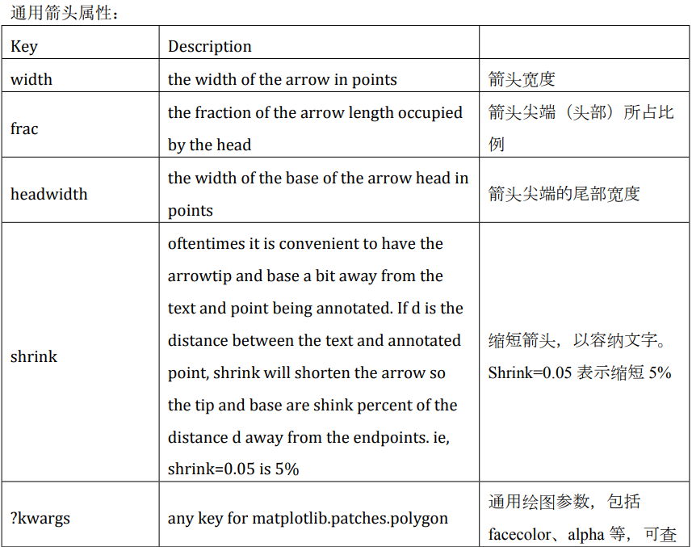
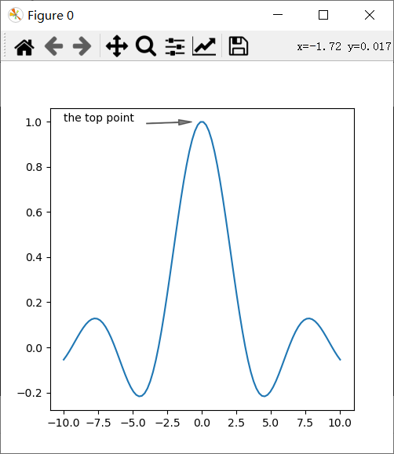
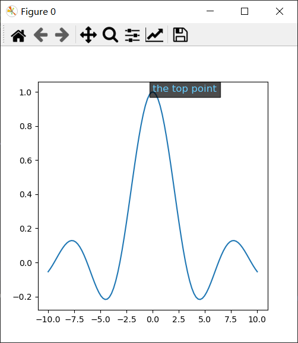

# 3.为图表添加注释
绘图时经常需要添加注释，标明参数，特殊点等。接下来我们介绍在mpl中的实现。
## 3.1 mpl.plt.annotate()函数
作用：创建一个文本注释，用箭头从指定点指向目标点。

函数格式：`annotate（"text"，xy，xytext=None，arrowprops=None，**kwargs）`
| 参数 | 数据类型 | 作用 |
| -- | -- | -- |
| "text" | 字符串 | 注释文本 |
| xy | 元组 | 待注释点坐标，如（1，5） |
| xytext | 元组 | 注释文本坐标，同上 |
| arrowprops | 字典 | 箭头调整参数 |

通用箭头属性如下：

***
```python
fig=plt.figure(num=0,figsize=(5,5))
ax=plt.axes()

x=np.linspace(-10,10,100)
y=np.sin(x)/x
ax.plot(x,y)
plt.annotate("the top point",(0,1),(-10,1),
             arrowprops=dict(
                 facecolor="black",#箭头颜色
                 width=0.5,#箭头身长
                 headwidth=5,#箭头尖端宽度
                 shrink=0.15,#缩短箭头比
                 alpha=0.5,#不透明度
                             ))
plt.show()
```


## 3.2 mpl.plt.text()函数
作用：在图中任意位置添加文本。
函数格式：`text(x, y, s, fontdict=None, **kwargs)`
* x,y：文本插入的位置坐标。

* s：文本。

* fontdict：字典，对文本内容的格式化，是一些通用参数。

```python
plt.text(0,1,"the top point",fontdict=dict(
    color="#66ccff",#颜色
    alpha=1,#不透明度
    fontsize=12#字体大小
),
         bbox=dict(facecolor="black",alpha=0.7))#为文本添加矩形框
plt.show()
```

