# mpl基础绘图实例

>matplotlib是一个建立在numpy上的，开源的python绘图库。绘图是数据可视化必不可少的一环。
>matplotlib可以作为matlab绘图的简易替代。

## 1. 简单线形图的两个例子
先来画两个简单的线形图。
### 1.1 折线图

`example 1.`
~~~python
import matplotlib.pyplot as plt#载入matplotlib的绘图模块pyplot，并且命名为pit。
plt.plot([1,9,6,42,5,6])#这里plot函数接受一个类数组数据，以其默认下标为横坐标，数值为纵坐标绘图(折线图)
plt.show()
~~~
>
***

### 1.2 曲线图

`example 2.`
~~~python
import matplotlib.pyplot as plt
import numpy as np
fig=plt.figure()#画板
ax=plt.axes()#坐标轴
x=np.linspace(0,np.pi*10,1000)
ax.plot(x,np.sin(x))#绘图
plt.xlim(-1,20)#x轴取值
plt.ylim(-1,1)#y轴取值
plt.show()#展示
~~~

>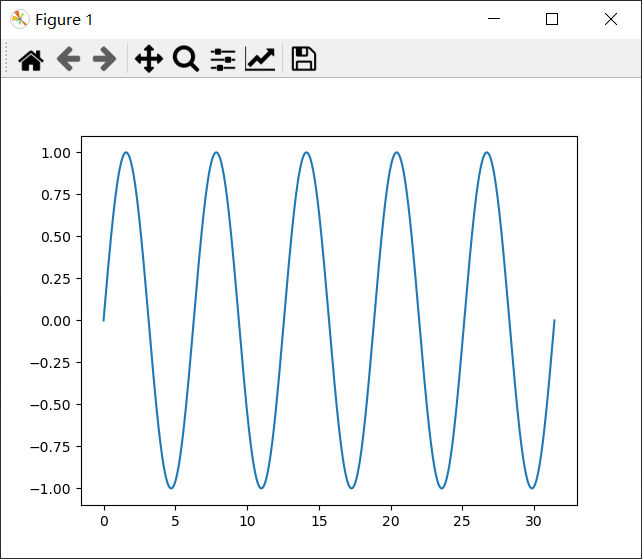

::::: tip tip1
matplotlib为用户提供了两种风格的接口：函数式和对象式。前者类似于matlab编程风格，适用于快速绘制简易图；后者适用于绘制复杂图形。

matlab风格接口绘图的好处在于，它维持绘图的状态(state)，持续跟踪当前的图形和坐标轴，所有plt命令都可以应用，因此绘图快而且方便。但绘制多个子图时可能会遇到复杂的问题。

我们主要看面向对象式绘图。
:::::


## 2. 简单线形图
### 2.1 画板(figure)、子图(axes)、绘图(plot)
~~~python
fig=plt.figure(num=0,figsize=(10,20))#第一个参数为图表编号，第二个为图表大小(绘图后仍可以调整，无关紧要)
ax=plt.axes()
~~~
* 如何理解`Figure`对象呢，首先，它是`plt.Figure`类的一个实例，它就是一个包含坐标轴，图形，文字的容器，是我们绘画的画板。

* `axes`是`plt.Axes`类的一个实例，是一个带刻度和标签的矩形，是我们用来绘图的画纸。一块画板当然可以贴好几张画纸。

有了画板fig和画纸ax后，我们就可以用`ax.plot()`(画笔)绘画了。  
::: tip tip2
请注意，`plt.plot()`和`ax.plot()`是两种风格的绘图方式；差异不大，但有一定区别。也即函数式和面向对象式的区别。  
:::

`plot`函数返回一个**列表**，列表里面的元素就是我们画出的“线条”对象（<class 'matplotlib.lines.Line2D'>），可供我们直接对其修改属性。我们调用其他的函数比如pie，fill，bar等都是类似的用法。

`example 3.`

```python
#--run--
import matplotlib.pyplot as plt

fig=plt.figure(num=0,figsize=(5,5))
ax=plt.axes()
x=np.linspace(-10,10,1000)
y=np.sin(x)/x
z=x**0.5
ax.plot(x,y,label="$sin(x)/x$",color='blue',linewidth=2,linestyle='--')
ax.plot(x,z,label="$x**0.5$",color='#66ccff',linewidth=1.5,linestyle=':')
'''
color：指定曲线的颜色，颜色可以用英文单词或以#字符开头的6位十六进制数表示，
例如'#ff0000’表示红色。或者使用值在0 到 1范围之内的三个元素的元组来表示,例如 
(1.0,0.0,0.0)也表示红色

linewidth: 指定曲线的宽度，可以不是整数，也可以使缩写形式的参数名lw。

label:给曲线指定一个标签，此标签将在图示中显示。如果标签字符串的前后有字符'$'，
matplotlib会将其显示为数学公式。
'''
plt.legend()
# legend:显示图示，即图中表示每条曲线的标签(label)和样式的矩形区域。
plt.savefig("the first.png",dpi=240)#保存图片，dpi指定分辨率
plt.show()
```

> 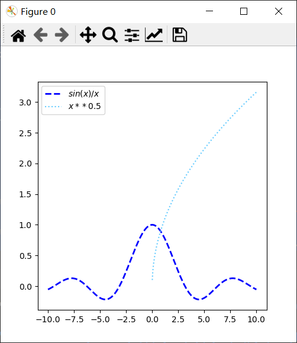

### 2.2 对线条的调整
> 颜色设置：  
> 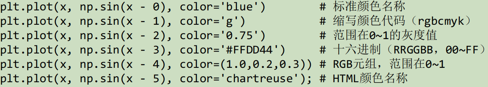  
> 类型设置：  
> 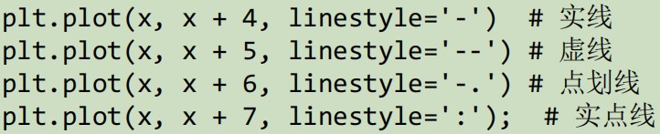  
> 组合使用：  
> 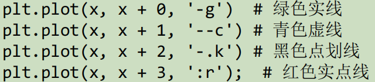  
***

`example4`
~~~python 
import matplotlib.pyplot as plt
import numpy as np

fig=plt.figure(num=0,figsize=(5,5))
ax=plt.axes()
x=np.linspace(-10,10,1000)
y1=0.5*x
y2=0.5*x+1
y3=0.5*x+2
y4=0.5*x+3
ax.plot(x,y1,'-r',
        x,y2,"--c",
        x,y3,"-.b",
        x,y4,":r")
plt.show()
~~~ 

> 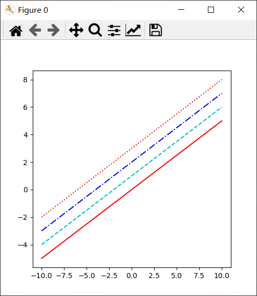

### 2.3 对坐标轴的调整

#### 2.3.1 ax.set()方法
我们可以使用ax.set()方法一次性设置坐标轴所有属性。
`example5`
~~~python
fig=plt.figure(num=0,figsize=(5,5))
ax=plt.axes()
x=np.linspace(-10,10,1000)
y=(x-5)**2-5
ax.plot(x,y,'-r')
ax.set(xlim=(0,10),ylim=(-5,5),xlabel='x',ylabel='y',title='text')
#依次是：x取值范围，y取值范围，x轴标签，y轴标签，图表名称。
plt.show()
~~~
***
> 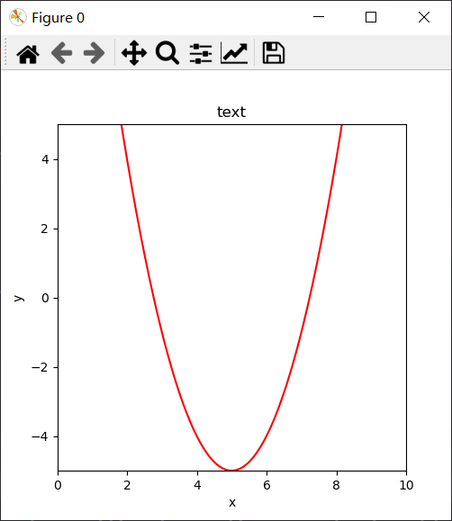

函数式绘图的方法转换：
> 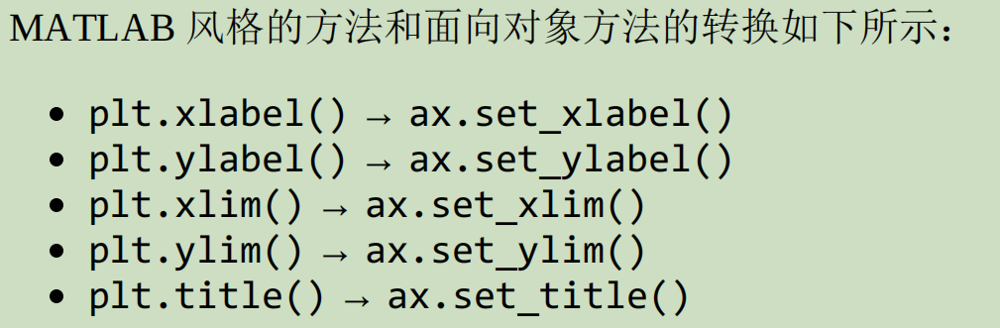

#### 2.3.2 axis()方法（注意区分axis与axes）
* axis()接受一个列表，设置x和y的最值。列表元素为[xmin,xmax,ymin,ymax]。
* axis()可以接受其他的参数，比如'tight'：自动调整坐标轴取值，收紧空白区域；'equal'：令x轴和y轴单位长度相等。

 

> * axis(tight)
>  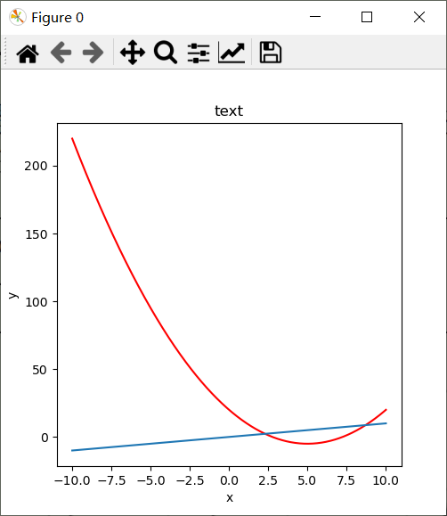
> 
> * axis(equal)
>  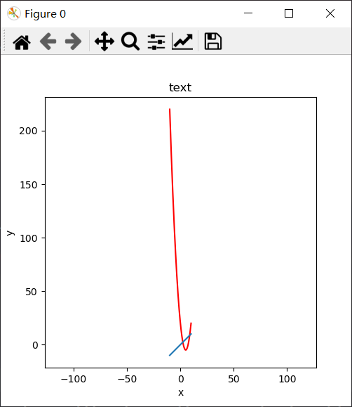

## 3. 简单散点图
### 3.1 plt.plot
之前我们见过这个常用的函数。现在我们用它来画散点图。

函数的主要参数为`plot（x，y，[fmt]，**kwargs）`

第三位参数为格式控制符，例如之前的线条的颜色，格式控制符。与之类似，当我们输入`'o'`，`'.'`，`'x'`，`'+'`，`'v'`，`'^'`等不同的格式符(我们称之为marker)时，将会出现不同的散点样式。它们还可以与线条，颜色代码结合使用。

第四位参数意为多组不同的参数，绘制多条线。

`example6`
~~~python
import matplotlib.pyplot as plt
import numpy as np
import random as rd

x=np.arange(0,10)
y0=[5*rd.random() for i in np.arange(10)]
y1=x+1
y2=[rd.uniform(2,6) for i in np.arange(10)]

plt.plot(x,y0,"--*r",label="y0")
#虚线，星点，红色
plt.plot(x,y1,"-xg",label="y1")
#实线，叉号，绿色
plt.plot(x,y2,"sb",label="y2")
#正方形，蓝色，散点
plt.legend()
plt.show()
~~~
***
> 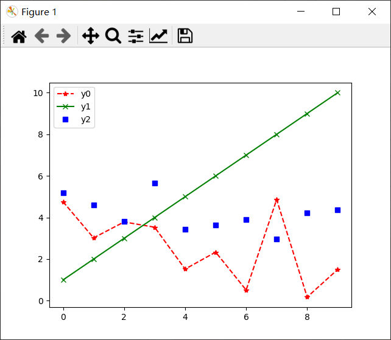

### 3.2 plt.scatter
plt.scatter与plt.plot相比，具有更高的灵活性，可以单独控制每个散点的属性，如大小颜色等。

函数格式：
`scatter(x, y, s=None, c=None, marker=None, cmap=None, norm=None, vmin=None, vmax=None, alpha=None, linewidths=None, verts=<deprecated parameter>, edgecolors=None, *, plotnonfinite=False, data=None, **kwargs)`
***
主要参数：

|参数|数据类型|说明|
|---|---|---|
| **x,y** |float or array-like, shape (n, )|类数组数据，是数据的坐标。|
|s|float or array-like, shape (n, ), optional|标量或类数组数据，可选参数，默认20，是数据点的大小。|
|c|array-like or list of colors or color, optional|颜色，可选参数，默认为‘b’。不能是单独的RGB数字或RGBA序列|
|marker||数据点的样式。即‘o’，‘x’，‘^’等。|
|cmap|str or `~matplotlib.colors.Colormap`, default: :rc:`image.cmap`|字符串或`matplotlib.colors.Colormap`类, 当且仅当c为一个浮点数数组的时候使用。默认为‘image.cmap’（那么这到底是什么意思呢）|
|norm|`~matplotlib.colors.Normalize`, default: None|如果*c*是一个浮点数数组，则使用*norm*缩放数据亮度，在0到1的范围内，以便映射到colormap。|
|vmin，vmax|float, default: None|设置亮度，如果norm实例已使用，该参数无效。|
|alpha|float, default: None|实数，设置数据透明度，取值范围0-1。|
|linewidth| float or array-like, default: :rc:`lines.linewidth`|浮点数或类数组数据，标记点边缘的线宽。默认为None。|

数据点的颜色以及样式，以下有具体说明：

> 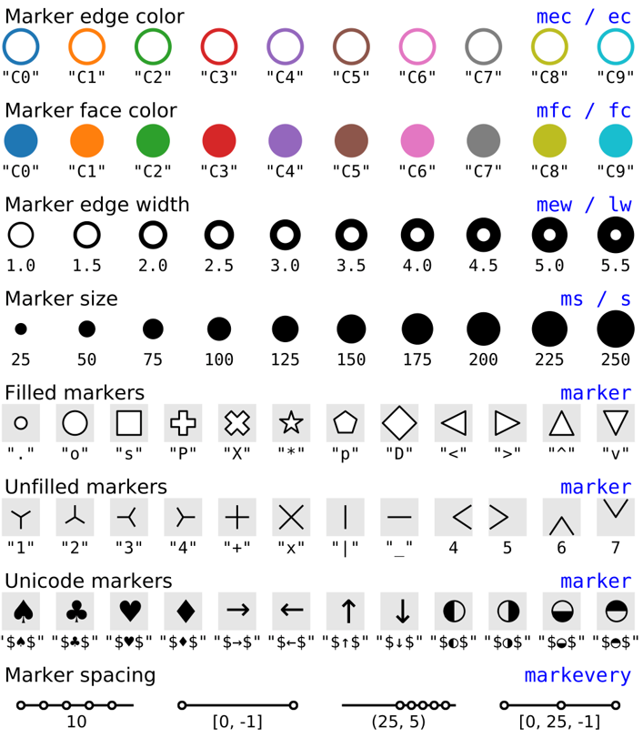


***
`example7`
~~~python
import matplotlib.pyplot as plt
import numpy as np
import random as rd
num=200
x=np.random.rand(num)
y=np.random.rand(num)
for i in range(0,num):
    plt.scatter(x[i],y[i],
                s=rd.uniform(1,300),
                c=rd.choice(["C0","C1","C2","C3","C4","C5","C6"]),
                marker= rd.choice([".","o","x","p","P","D","<",">"]),
                alpha=rd.random(),cmap='viridis')
plt.show()
~~~
> 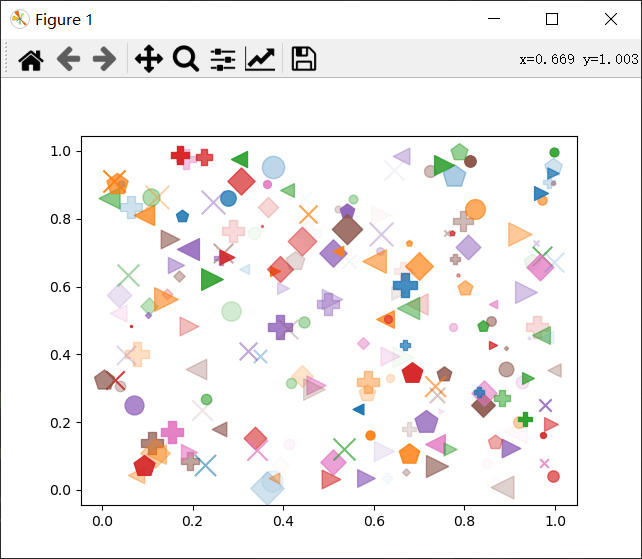