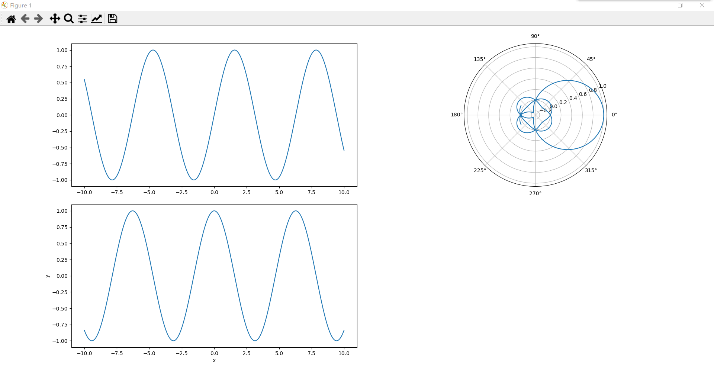
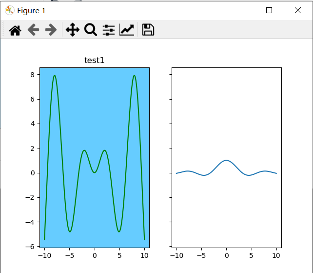

# 多子图的创建
有很多方法可供我们在一块画板（figure）上添加多个子图。
## 1. plt.axes()
作用：向当前图形添加坐标轴，并使其为当前坐标轴。

* 函数格式：axes(arg=None, **kwargs)
    * `arg` : None or 4-tuple
        * 如果默认为None，就相当于创建默认的完整的 subplot（111）图轴。
        * 如果为四元组，即（left，bottom，width，height），参数均在（0，1）之间，就是创建图中图。

不要混淆axes（）和axis（），前者是用于创建子坐标轴（子图），后者用于获取或设置轴属性。具体见`1.md坐标轴的调整`

---

`example1`
```python
fig=plt.figure(figsize=(10,5))
ax1=plt.axes(xlabel="x",ylabel="y")
x=np.linspace(-10,10,1000)
y1=np.sin(x)
plt.plot(x,y1,"r")
#子图
ax2=plt.axes([0.65,0.60,0.2,0.2],
             facecolor="black",
             alpha=1,
             projection="polar"#极坐标
             )
y2=np.sin(x)
plt.plot(x,y2,"b")
plt.show()
```


---

## 2. fig.add_axes()
作用：面向对象式方法。向画板添加新的坐标轴。

> 函数格式：add_axes(self, *args, **kwargs)

第一个参数rect：[left, bottom, width, height]，参数均在（0，1）之间，标注了子图在figure的位置以及大小。
其余为通用参数设置。 

---

`example2`
```python
fig=plt.figure(figsize=(10,5))
#第一个子图
ax1=fig.add_axes([0.1,0.55,0.4,0.4])
x=np.linspace(-10,10,1000)
y1=np.sin(x)
ax1.plot(x,y1)
#第二个子图
ax2=fig.add_axes([0.1,0.1,0.4,0.4],xlabel="x",ylabel="y")
y2=np.cos(x)
ax2.plot(x,y2)
#第三个子图
ax3=fig.add_axes([0.55,0.55,0.4,0.4],polar=True)
y3=y1*y2/x
ax3.plot(x,y3)
#第四个子图
ax4=fig.add_axes([0.55,0.1,0.4,0.4])
#删除第四个子图
fig.delaxes(ax4)
plt.show()
```


---

## 3. plt.subplots()

作用：创建一个图形和一组副图。**用一行代码创建多个子图**，是最常用的方法。

python的理念就是，能用一行代码就解决的问题，坚决不用两行代码。反正都是调包嘛！

> 函数以**元组**形式返回一个图像（figure）对象，和**numpy一维或二维数组**(其形状就是（nrows, ncols）)形式的一系列子图或坐标轴（axes）对象。

函数格式：`subplots(nrows=1, ncols=1, *, sharex=False, sharey=False, squeeze=True, subplot_kw=None, gridspec_kw=None, **fig_kw)`

| 参数 | 类型 | 说明 |
| -- | -- | -- |
| **nrows, ncols** | int, default: 1 | 子图网格的行列数，其实就是返回的子图数组的形状。例如2，3就是二行三列共6个子图。 |
| sharex, sharey | bool or {'none', 'all', 'row', 'col'}, default: False | 控制子图x，y轴的共享。  - `True或'all'`: x轴或y轴将在所有子图中共享。  - `False或'none'`:每个子图x或y轴将是独立的。  - `'row'`:每个子图行共享一个x或y轴。  - `'col'`:每个子图列将共享一个x或y轴。 |
| subplot_kw | dict, optional | 可选子图修饰参数。 |
| gridspec_kw | dict, optional | 可选网格修饰参数。 |
| **fig_kw | -- | 可选图像（figure）修饰参数。 |

---

`example 3.`
```python
1 fig,((ax1,ax2),(ax4,ax5))=plt.subplots(2,2)
# 创建2*2共4个子图
2 fig,((ax1,ax2,ax3),(ax4,ax5,ax6))=plt.subplots(2,3)
# 创建2*3共6个子图
3 fig,ax=plt.subplots(2,3)
# 创建2*3共6个子图
```

```python
fig,ax=plt.subplots(2,3,sharex="col",
                    sharey="row",
                    subplot_kw=dict(
                        facecolor="#66ccff",
                        xlim=(0,10),
                        ylim=(-1,1),
                        alpha=0.5
                    ),
                    )
x=np.linspace(-10,10,1000)
y1=np.sin(x)
plt.plot(x,y1)
plt.show()
```


`example 4.`
```python
fig,(ax1,ax2)=plt.subplots(1,2,sharex=True,sharey=True)
x=np.linspace(-10,10,1000)
y1=np.sin(x)
ax1.plot(x,y1*x,"g")
ax1.set(title="test1",facecolor="#66ccff")
ax2.plot(x,y1/x)
plt.show()
```
