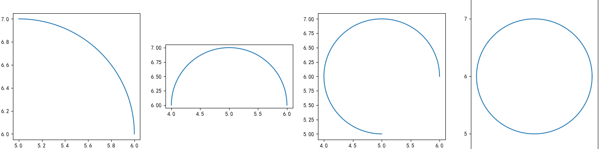

# 5.圆
画圆。
## 1. 方程画圆

### 1.1 参数方程
一个圆心坐标为 `(a,b)`，半径为 `r` 的圆方程为：

$[{(x-a)\over r}]^2 + [{(x-b)\over r}]^2 =1。$

又 $sin\space x^2+ cos\space x^2=1$,得圆（5，6）上的点(a,b)满足：$a=r*cosx+a;b=r*cosx+b$。利用参数方程还可以绘制圆弧。

```python
import numpy as np
import matplotlib.pyplot as plt

fig,ax=plt.subplots(1,4)

for i in range(1,5):#画四段圆弧
    theta = np.linspace(0, 0.5*i*np.pi, 500)
    radius = 1#圆的半径
    #一个圆心坐标为(x,y)，半径为r的圆方程为：[(x-a)/r]^2+[(x-b)/r]^2=1。
    #又sin^2+cos^2=1,得圆（5，6）上的点(a,b)满足：
    a = radius*np.cos(theta)+5
    b = radius*np.sin(theta)+6

    ax[i-1].plot(a, b)
    plt.axis("equal")
    ax[i-1].set_aspect(1)

plt.title('Circle using Parametric Equation')
plt.show()
```


---

## 2. 画圆

```python
def draw_circle():
    fig,ax=plt.subplots()
    ax.axis("equal")
    plt.axis("off")
    a = np.linspace(0, 2 * np.pi, 1000)
    x0 = 5*np.cos(a)
    y0 = 5*np.sin(a)
    plt.fill(x0,y0)
    plt.savefig("circle.jpg")
    plt.show()
```
